# Telecom-Stream-Pipeline 

## Table of Contents 
- [Introduction](#introduction)
- [System Architecture](#System-Architecture)
- [Tech Stack & Tools](#tech-stack--tools)
- [Assumptions](#assumptions)
- [Environment Setup](#Environment-Setup)
- [Project Structure](#Project-Structure)
- [Ingestion Architecture](#Ingestion-Architecture)
- [Data Processing Layer](#Data-Processing-Layer)
- [Pipeline Architecture](#pipeline-architecture)
- [DBT Models](#DBT-Models)
- [Airflow DAG Overview](#airflow-dag-overview)
- [Data Warehouse Model](#data-warehouse-model)
- [Data Lineage](#data-lineage)
- [Reporting](#reporting)

## Introduction 
This project is designed to process  Telecom data in **Near real-time**, enabling analytics

## System Architecture

## Tech Stack & Tools
- **DBT (Data Build Tool)**: For 	Building business  data models.
- **Spark**: 	Cleans, enriches, aggregates the raw data (heavy lifting)..
- **Snowflake**: As the data warehouse.
- **Docker**: To containerize and standardize the development environment.
- **HDFS**: Raw data landing zone.
- **Python**: For scripting and automation.
- **Airflow** : For orchestrating ETL workflows.
- **Power BI** : For visualizing the reporting layer.

## Assumptions
Docker, Kafka, HDFS, and Spark are containerized and properly configured.
Kafka streams telecom events to pre-created topics.
Spark reads raw events from HDFS bronze, transforms them, and writes to silver (Parquet).
Airflow orchestrates the ETL; dbt builds models in Snowflake from the silver layer.

## Environment Setup

## Project Structure
    ├── dags/                     
    ├── Scripts/                  
    │   ├── Kafka/                
    │   ├── Spark/                
    │   ├── python/                 
    ├── config/                    
    ├── includes/
    |   ├── dbt/
    |   |      ├── TELECOM             
    ├── tests/                    
    ├── docker-compose.yaml       
    ├── environment.env           
    ├── .gitignore                
    └── README.md                

## Pipeline Architecture

The project follows the Medallion Architecture, which organizes data into three layers:

    Bronze Layer (Raw Data): Stores unprocessed and ingested data from various sources.
    Silver Layer (Cleansed Data): Cleans and pre-processes data for transformation and enrichment.
    Gold Layer (Aggregated Data): Optimized for analytics, reporting, and business intelligence.

## Ingestion Architecture

## Data Processing Layer

## Airflow DAG Overview
![airflow]

DAG 1 – telecom_stream_pipeline

    upload_to_snowflake_task: Uploads cleaned data from HDFS silver layer to Snowflake.

    trigger_dbt_dag: Triggers the second DAG for model building and testing.

### dbt_pipeline

DAG 2 – dbt_transform_pipeline

    dbt_snapshot_group: Runs dbt snapshot jobs to capture slowly changing dimensions.

    dbt_dimension_group: Builds cleaned and enriched dimension models.

    dbt_fact_group: Creates analytical fact tables based on the dimension data.

see DAG : [airflow DAG](https://github.com/MAHMOUDMAMDOH8/Telecom-Stream-Pipeline/tree/main/dags)

## DBT Models
#### dim_date

        {{
            config(
                materialized='incremental',
                unique_key='Date_key',
                indexes=[{"columns": ['Date_key'], "unique": true}],
                target_schema='Gold'
            )
        }}
        
        with formatted_sms_date as (
            select 
                to_timestamp(timestamp, 'DD-MM-YYYY HH24:MI:SS') as formatted_timestamp
            from {{ source('row_data', 'SMS') }}
            where timestamp is not null
        ),
        formatted_call_date as (
            select 
                to_timestamp(timestamp, 'DD-MM-YYYY HH24:MI:SS') as formatted_timestamp
            from {{ source('row_data', 'CALL_DATA') }}
            where timestamp is not null
        ),
        
        unioned_dates as (
            select formatted_timestamp from formatted_sms_date
            union
            select formatted_timestamp from formatted_call_date
        ),
        
        date_components as (
            select distinct
                formatted_timestamp as full_date,
                md5(formatted_timestamp) as Date_key,
                extract(day from formatted_timestamp) as day,
                extract(month from formatted_timestamp) as month,
                extract(year from formatted_timestamp) as year,
                to_char(formatted_timestamp, 'Day') as day_name,
                to_char(formatted_timestamp, 'Month') as month_name,
                extract(quarter from formatted_timestamp) as quarter,
                extract(dow from formatted_timestamp) as day_of_week,
                extract(doy from formatted_timestamp) as day_of_year,
                extract(hour from formatted_timestamp) as hour_24,
                to_char(formatted_timestamp, 'HH24:MI') as hour_minute,
                to_char(formatted_timestamp, 'HH12 AM') as hour_am_pm,
                concat('Q', extract(quarter from formatted_timestamp)) as quarter_name
            from unioned_dates
        )
        
        select * from date_components
        
        where Date_key not in (select Date_key from {{ this }})
        

see more : [DBT Models](https://github.com/MAHMOUDMAMDOH8/Telecom-Stream-Pipeline/tree/main/includes/dbt/TELECOM/models/gold)

## Data Warehouse Model

```mermaid
erDiagram

    Dim_user {
        int USER_ID PK
        string FIRST_NAME
        string LAST_NAME
        string PHONE_NUMBER
        string CITY
        string EMAIL
        string SEX
    }

    Dim_cell_site {
        string SITE_ID PK
        string CELL_ID
        string CITY
        float LATITUDE
        float LONGITUDE
        string SITE_NAME
    }

    Dim_device_tac {
        string TAC_ID PK
        string MANUFACTURER
        string TAC_CODE
    }

    Dim_date {
        int DATE_KEY PK
        string FULL_DATE
        int DAY
        int MONTH
        int YEAR
        string DAY_NAME
        string MONTH_NAME
        int QUARTER
        int DAY_OF_WEEK
        int DAY_OF_YEAR
        int HOUR_24
        string HOUR_MINUTE
        string HOUR_AM_PM
        string QUARTER_NAME
    }

    Fact_events {
        string EVENT_ID PK
        int SENDER_ID FK
        int RECEIVER_ID FK
        string SENDER_SITE_ID FK
        string RECEIVER_SITE_ID FK
        string SENDER_DEVICE_ID FK
        string RECEIVER_DEVICE_ID FK
        int DATE_KEY FK
        string PLAN_SENDER
        string RECEIVER_PLAN
        int CALL_DURATION_SECONDS
        string CALL_TYPE
        string STATUS
        string REG_DATE
        float AMOUNT
        string CURRENCY
    }

    Fact_events }|--|| Dim_user : "sender_id → USER_ID"
    Fact_events }|--|| Dim_user : "receiver_id → USER_ID"
    Fact_events }|--|| Dim_cell_site : "sender_site_id → SITE_ID"
    Fact_events }|--|| Dim_cell_site : "receiver_site_id → SITE_ID"
    Fact_events }|--|| Dim_device_tac : "sender_device_id → TAC_ID"
    Fact_events }|--|| Dim_device_tac : "receiver_device_id → TAC_ID"
    Fact_events }|--|| Dim_date : "DATE_KEY → DATE_KEY"
```

## Data Lineage 

## Reporting

### Home 

### overview 

### users 

### cell site

# Contact Information
📧 Email: [mahmoud.mamdoh0812@gmail.com](mailto:mahmoud.mamdoh0812@gmail.com)  
🔗 LinkedIn: [Mahmoud Mamdoh](https://www.linkedin.com/in/mahmoud-mamdoh-47a68a203/)  
🐦 Twitter: [@M7M0UD_D](https://x.com/M7M0UD_D)

For any queries, feel free to reach out!

